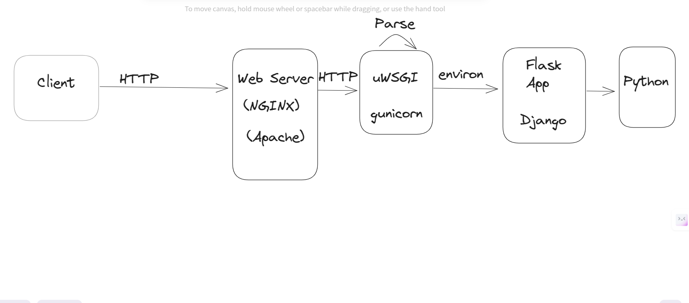

# WSGI & ASGI

## WSGI (Web Server Gateway Interface)

Is standard interface between **web servers** and Python **web application** or **frameworks**, to support web application portability across a variety of web servers. It is a Python standard described in PEP 333(3).

## ASGI (Asynchronous Server Gateway Interface)
Is a successor to WSGI and is designed to handle asynchronous code.

| Feature | WSGI | ASGI |
| ------- | ---- | ---- |
| Type    | Synchronous | Asynchronous |
| Support Websocket | No | Yes |
| Concurrency | Blocking, handles one request at time per worker| Non-blocking, can handle multiple requests concurrently |
| Use cases| traditional web applications | Real-time applications, chat applications, and other applications that require long-lived connections |
| Used in | Flask, Django, and other synchronous frameworks | Django Channels, FastAPI, and other asynchronous frameworks |

### uWSGI and Gunicorn 
Are application servers gateway interfaces written in python used to run Python web applications, they parse incoming requests and pass them to the python application, and then return the response to the web server.

| Feature | uWSGI | Gunicorn |
| ------- | ----- | -------- |
| Performance | High performance, but complex to configure | simple, easier to configure |
| Concurrency Model| Supports multiple workers types (threading, forking, async) | user pre-fork worker model (each worker is a separate process) |
| WSGI/ASGI | Supports both WSGI and ASGI | Supports  WSGI and needs a wrapper like `uvicorn` for ASGI |
| Websockets | Supports Websockets | Does not support Websockets (needs ASGI server like `daphne` and `uvicorn`)|

### Gunicorn architecture
- Gunicorn is a pre-fork worker model, and follows the master-worker model where the master process manages the worker processes.
  
#### Master Process
- The master worker never knows anything about the individual clients. All requests and responses are handled completely by the worker processes.
- The master process in a simple loop that listen for various process signals and reacts to it, this signals can be like
`TTIN` and `TTOU` to increase or decrease the number of workers, `CHLD` mean child process terminated.

#### Worker Process
- The default worker process i a synchronous worker, which means it handles one request at a time, and blocks until the request is completed.
- `sync` worker does not support persistent connection which mean each connection is closed after the response is sent.
- `async` workers not supported by Gunicorn, but can be used with `uvicorn` or `daphne` servers.
- the default `sync` worker is suitable for resource-bound in terms of `CPU` and network bandwidth, they are not for tasks like long polling, using external web services, etc.
- Recommended Number of workers to start with is = `Number of CPU cores * 2 + 1`